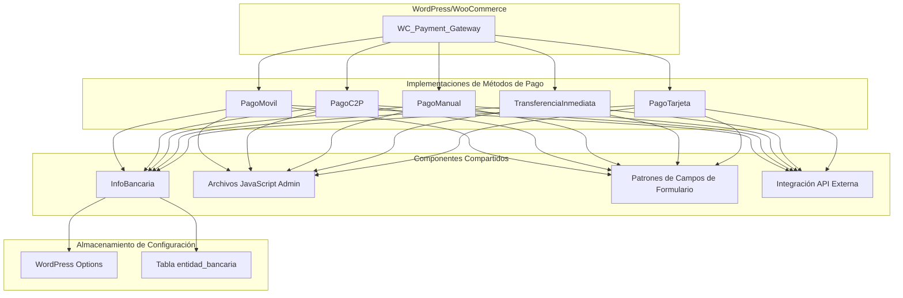
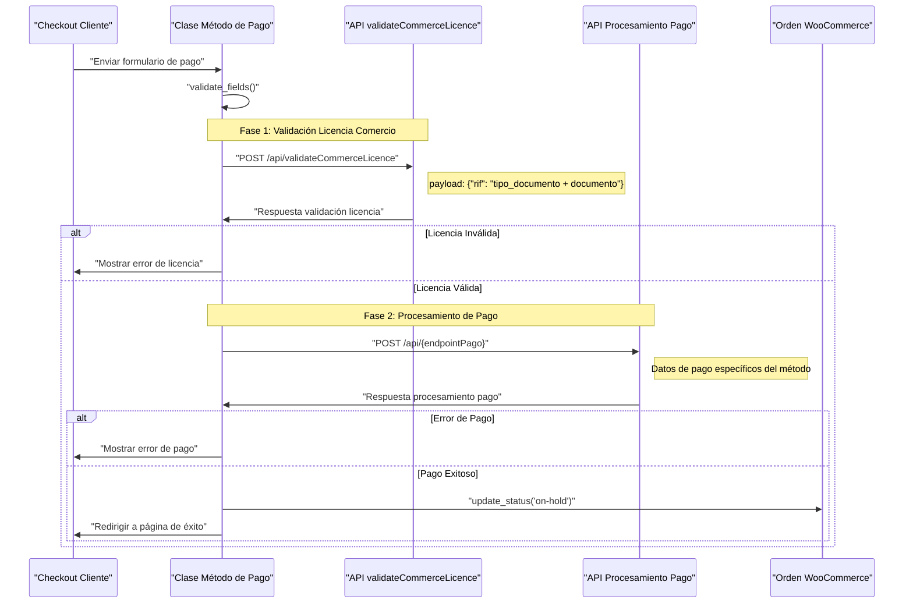
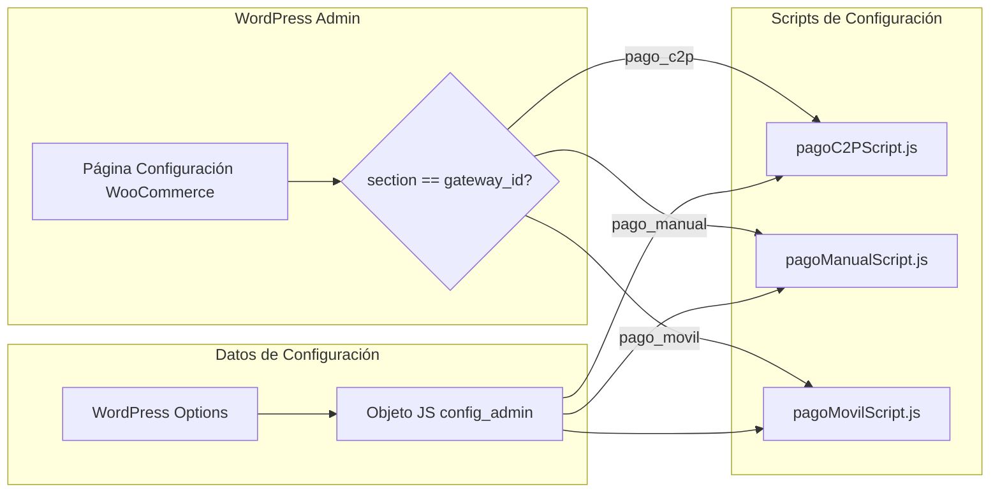

## Resumen de la Arquitectura

El plugin implementa un sistema de métodos de pago para WooCommerce que sigue un patrón arquitectónico estandarizado <cite/>. Todos los métodos de pago extienden la clase `WC_Payment_Gateway` de WooCommerce y siguen patrones consistentes para configuración, validación y procesamiento de pagos a través de APIs externas <cite/>.

## Estructura Común de Clases

## Métodos de Pago Implementados

Actualmente se han implementado tres de los cinco métodos planificados <cite/>:

- **PagoMovil** (`metodosPago/pagoMovil.php`): Pagos móviles P2C con soporte para códigos QR [1](#0-0) 
- **PagoC2P** (`metodosPago/pagoC2P.php`): Pagos Cliente-a-Persona con validación OTP [2](#0-1) 
- **PagoManual** (`metodosPago/pagoManual.php`): Reporte y validación manual de transacciones <cite/>

## Flujo de Integración con API Externa

Todos los métodos de pago siguen un patrón de integración de dos fases consistente <cite/>:

## Sistema de Configuración Admin

Cada método de pago incluye JavaScript dedicado para la gestión de configuración admin [3](#0-2) :

## Endpoints de API y Configuración

Cada método utiliza diferentes endpoints pero sigue los mismos patrones de autenticación [4](#0-3) :

- **PagoC2P**: `172.30.145.250:4000/api/purchaseC2P`
- **PagoManual**: `172.30.145.250:4000/api/validateManualPayment` [5](#0-4) 
- **PagoMovil**: `172.30.145.250:4000/api/validatePaymentP2c` [6](#0-5) 

**Notes**

La arquitectura está diseñada para ser extensible, con dos métodos adicionales planificados: `PagoTarjeta` y `TransferenciaInmediata` <cite/>. El archivo `transferenciaInmediata.php` ya existe pero parece estar en desarrollo [7](#0-6) . Todos los métodos comparten la misma estructura de validación de campos y manejo de errores, lo que facilita el mantenimiento y la consistencia del código.

Wiki pages you might want to explore:
- [Payment Gateway Methods (TCSCA/plugin_boton_pago)](/wiki/TCSCA/plugin_boton_pago#3)
