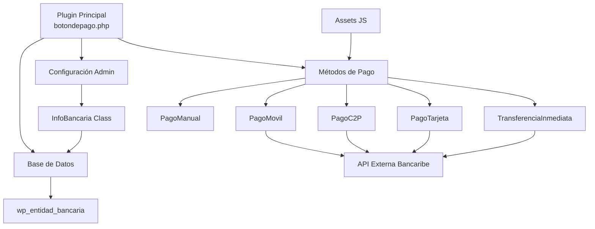
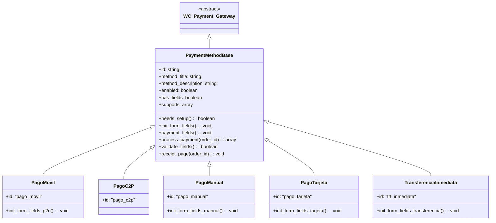
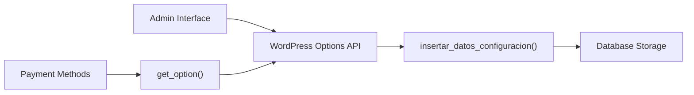
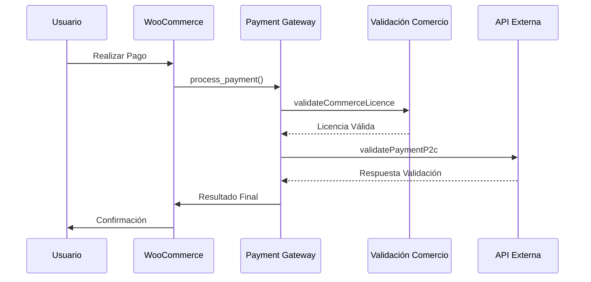
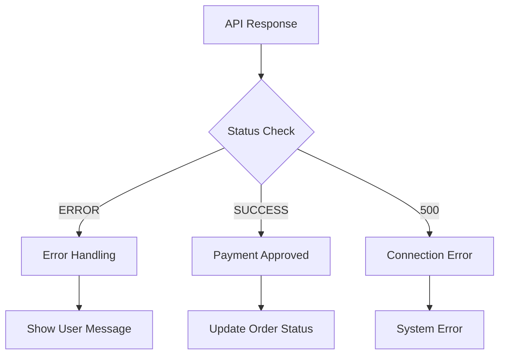
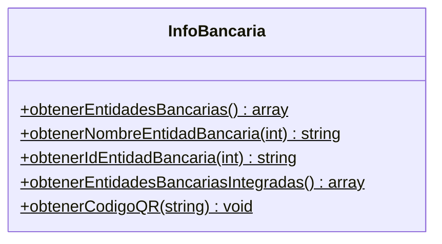
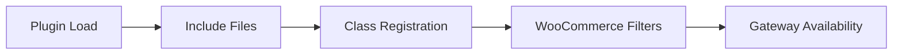

# Documentación Técnica: Payment Gateway Methods

**Versión:** 1.7.9  
**Fecha:** Diciembre 2024  
**Autor:** Technology Consulting Solutions (T.C.S)  

## Resumen

El módulo **Payment Gateway Methods** es un plugin para WooCommerce que implementa múltiples métodos de pago venezolanos integrados con APIs bancarias externas. [1](#0-0)  El sistema proporciona cinco métodos de pago especializados: Pago Móvil P2C, Pago C2P, Pago Manual, Pago con Tarjeta y Transferencia Inmediata, todos con validación en tiempo real a través de servicios externos.

## Diagrama de Arquitectura General



## Estructura Común de Clases

Todos los métodos de pago siguen una arquitectura común basada en herencia de `WC_Payment_Gateway`:



### Propiedades Comunes

Cada método de pago implementa las siguientes propiedades base: [2](#0-1) 

- **ID único:** Identificador del gateway de pago
- **Título del método:** Nombre mostrado al usuario
- **Descripción:** Información detallada del método
- **Soporte de productos:** Compatibilidad con productos WooCommerce
- **Campos personalizados:** Formularios específicos por método

## Métodos de Pago Implementados

### 1. PagoMovil (Pago Móvil P2C)

**Archivo:** `metodosPago/pagoMovil.php`

**Características:**
- **ID:** `pago_movil` [3](#0-2) 
- **Integración:** API Bancaribe para validación inmediata
- **Campos de entrada:** Documento, banco, teléfono, monto, referencia
- **Código QR:** Generación automática para facilitar pagos [4](#0-3) 

**Validaciones específicas:**
- Documento mínimo 6 dígitos [5](#0-4) 
- Teléfono mínimo 7 dígitos [6](#0-5) 
- Referencia mínimo 6 dígitos [7](#0-6) 

### 2. PagoC2P (Commerce to Person)

**Archivo:** `metodosPago/pagoC2P.php`

**Características:**
- **ID:** `pago_c2p` [8](#0-7) 
- **Especialización:** Pagos de comercio a persona
- **Integración:** Solo entidades bancarias integradas [9](#0-8) 

**Validaciones específicas:**
- Documento mínimo 6 dígitos [10](#0-9) 
- Teléfono mínimo 7 dígitos [11](#0-10) 
- Referencia mínimo 6 dígitos [12](#0-11) 

### 3. PagoManual (Reporte Manual)

**Archivo:** `metodosPago/pagoManual.php`

**Características:**
- **ID:** `pago_manual` [13](#0-12) 
- **Modalidad:** Verificación manual posterior
- **Datos mostrados:** Información bancaria completa para transferencia [14](#0-13) 

**Validaciones específicas:**
- Documento mínimo 6 dígitos [15](#0-14) 
- Teléfono mínimo 7 dígitos [16](#0-15) 
- Referencia mínimo 6 dígitos [17](#0-16) 

### 4. PagoTarjeta (Pago con Tarjeta)

**Archivo:** `metodosPago/pagoTarjeta.php`

**Características:**
- **ID:** `pago_tarjeta` [15](#0-14) 
- **Procesamiento:** Pagos con tarjetas de crédito/débito
- **Assets específicos:** Logo de tarjetas [16](#0-15) 

**Validaciones específicas:**
- Documento mínimo 6 dígitos [17](#0-16) 
- Teléfono mínimo 7 dígitos [18](#0-17) 
- Referencia mínimo 6 dígitos [19](#0-18) 

### 5. TransferenciaInmediata (Transferencia Inmediata)

**Archivo:** `metodosPago/transferenciaInmediata.php`

**Características:**
- **ID:** `trf_inmediata` [19](#0-18) 
- **Funcionalidad:** Transferencias bancarias en tiempo real
- **Información:** Datos completos del comercio [20](#0-19) 

**Validaciones específicas:**
- Documento mínimo 6 dígitos [21](#0-20) 
- Teléfono mínimo 7 dígitos [22](#0-21) 
- Referencia mínimo 6 dígitos [23](#0-22) 

## Sistema de Configuración Admin

### Interfaz de Administración

El sistema incluye un menú administrativo completo: [17](#0-16) 

**Campos de configuración principales:**
- Nombre del comercio [18](#0-17) 
- Tipo de documento [19](#0-18) 
- RIF/Cédula [20](#0-19) 
- Código de activación [21](#0-20) 
- Información bancaria [22](#0-21) 
- Credenciales API Bancaribe [23](#0-22) 

### Gestión de Configuración



Las configuraciones se almacenan usando WordPress Options API: [23](#0-22) 

## Flujo de Integración con API Externa

### Proceso de Validación de Pagos



### APIs y Endpoints

El plugin se integra con varios endpoints para la validación de pagos y gestión de transacciones. A continuación se detallan todos los endpoints utilizados:

#### 1. Validación de Comercio
- **Endpoint:** `/api/validateCommerceLicence`
- **Método:** POST
- **Descripción:** Verifica la validez de la licencia del comercio antes de procesar cualquier pago.
- **Headers requeridos:**
  ```
  Content-Type: application/json
  User-Agent: Mozilla/5.0
  KEY: key12345
  ```
- **Parámetros de entrada (JSON):**
  ```json
  {
    "rif": "string" // Formato: [tipo_documento][número_documento] (ej: "J123456789")
  }
  ```
- **Respuesta exitosa (200 OK):**
  ```json
  {
    "status": "SUCCESS",
    "data": {
      // Datos de la licencia del comercio
    }
  }
  ```
- **Respuesta de error:**
  ```json
  {
    "status": "ERROR",
    "data": "Mensaje de error descriptivo"
  }
  ```

#### 2. Validación de Pagos P2C (Person to Commerce)
- **Endpoint:** `/api/validatePaymentP2c`
- **Método:** POST
- **Descripción:** Valida y procesa un pago móvil de persona a comercio.
- **Headers requeridos:**
  ```
  Content-Type: application/json
  User-Agent: Mozilla/5.0
  KEY: key12345
  ```
- **Parámetros de entrada (JSON):**
  ```json
  {
    "rif": "string",              // RIF del comercio
    "payerDocument": "string",    // Documento del pagador con tipo (ej: "V12345678")
    "debitPhone": "string",       // Teléfono del pagador con código de área
    "referenceNumber": "string",  // Número de referencia del pago
    "transactionAmount": number,   // Monto de la transacción
    "bankPayment": "string",      // ID del banco
    "paymentChannel": number,      // Canal de pago (1 para móvil)
    "email": "string"            // Email del cliente
  }
  ```

#### 3. Validación de Pago Manual
- **Endpoint:** `/api/validateManualPayment`
- **Método:** POST
- **Descripción:** Valida un pago realizado manualmente por transferencia o depósito.
- **Headers requeridos:**
  ```
  Content-Type: application/json
  User-Agent: Mozilla/5.0
  KEY: key12345
  ```
- **Parámetros de entrada (JSON):**
  ```json
  {
    "rif": "string",              // RIF del comercio
    "payerDocument": "string",    // Documento del pagador con tipo
    "debitPhone": "string",       // Teléfono del pagador con código de área
    "referenceNumber": "string",  // Número de referencia del pago
    "typeTransaction": "string",  // Tipo de transacción
    "bankCode": "string",         // Código del banco
    "transactionAmount": number,   // Monto de la transacción
    "paymentChannel": number,      // Canal de pago (1 para móvil)
    "email": "string"            // Email del cliente
  }
  ```

#### 4. Compra C2P (Commerce to Person)
- **Endpoint:** `/api/purchaseC2P`
- **Método:** POST
- **Descripción:** Procesa un pago de comercio a persona.
- **Headers requeridos:**
  ```
  Content-Type: application/json
  User-Agent: Mozilla/5.0
  KEY: key12345
  ```
- **Parámetros de entrada (JSON):**
  ```json
  {
    "rif": "string",                 // RIF del comercio
    "phoneNumberCommerce": "string",  // Teléfono del comercio
    "nameCommerce": "string",        // Nombre del comercio
    "identificationDocument": "string", // Documento del beneficiario
    "phoneNumber": "string",         // Teléfono del beneficiario
    "bankPayment": "string",         // ID del banco
    "transactionAmount": number,      // Monto de la transacción
    "concept": "string",            // Concepto del pago
    "otp": "string",                // Código OTP de validación
    "paymentChannel": number,         // Canal de pago
    "email": "string"               // Email del cliente
  }
  ```

#### 5. Pago con Tarjeta de Débito
- **Endpoint:** `/api/debitCardPayment`
- **Método:** POST
- **Descripción:** Procesa un pago con tarjeta de débito.
- **Headers requeridos:**
  ```
  Content-Type: application/json
  User-Agent: Mozilla/5.0
  KEY: key12345
  ```
- **Parámetros de entrada (JSON):**
  ```json
  {
    "rif": "string",                 // RIF del comercio
    "currency": "string",           // Moneda (ej: "VED")
    "amount": number,                // Monto de la transacción
    "paymentChannel": number,        // Canal de pago
    "reason": "string",             // Concepto del pago
    "bankPayment": "string",        // ID del banco
    "debitCard": {
      "holderName": "string",      // Nombre del titular
      "holderId": "string",        // Documento del titular con tipo
      "holderIdDoc": "string",     // Tipo de documento
      "cardNumber": "string",      // Número de tarjeta
      "cvc": "string",             // Código de seguridad
      "expirationMonth": number,    // Mes de expiración (1-12)
      "expirationYear": number,     // Año de expiración (2 dígitos)
      "cardType": "DEBIT",         // Tipo de tarjeta
      "accountType": "string",     // Tipo de cuenta
      "pin": "string"              // PIN de la tarjeta
    },
    "email": "string"              // Email del cliente
  }
  ```

#### 6. Pago con Tarjeta de Crédito
- **Endpoint:** `/api/creditCardPayment`
- **Método:** POST
- **Descripción:** Procesa un pago con tarjeta de crédito.
- **Headers requeridos:**
  ```
  Content-Type: application/json
  User-Agent: Mozilla/5.0
  KEY: key12345
  ```
- **Parámetros de entrada (JSON):**
  ```json
  {
    "rif": "string",                 // RIF del comercio
    "currency": "string",           // Moneda (ej: "VED")
    "amount": number,                // Monto de la transacción
    "paymentChannel": number,        // Canal de pago
    "reason": "string",             // Concepto del pago
    "bankPayment": "string",        // ID del banco
    "creditCard": {
      "holderName": "string",      // Nombre del titular
      "holderId": "string",        // Documento del titular con tipo
      "holderIdDoc": "string",     // Tipo de documento
      "cardNumber": "string",      // Número de tarjeta
      "cvc": "string",             // Código de seguridad
      "expirationMonth": number,    // Mes de expiración (1-12)
      "expirationYear": number,     // Año de expiración (2 dígitos)
      "cardType": "CREDIT",        // Tipo de tarjeta
      "installments": number,       // Número de cuotas
      "pin": "string"              // PIN de la tarjeta (opcional)
    },
    "email": "string"              // Email del cliente
  }
  ```

#### 7. Guardar Configuración del Comercio
- **Endpoint:** `/api/saveCommerceConfig`
- **Método:** POST
- **Descripción:** Actualiza la configuración del comercio en el sistema.
- **Headers requeridos:**
  ```
  Content-Type: application/json
  User-Agent: Mozilla/5.0
  KEY: key12345
  CONFIRMATION_KEY: string
  ```
- **Parámetros de entrada (JSON):**
  ```json
  {
    "idBank": "string",                // ID del banco
    "bankAccount": "string",          // Número de cuenta bancaria
    "consumerKey": "string",          // Clave de consumidor
    "consumerSecret": "string",       // Secreto del consumidor
    "consumerKeyCreditCard": "string", // Clave de consumidor para tarjetas
    "consumerSecretCreditCard": "string", // Secreto para tarjetas
    "rif": "string",                  // RIF del comercio (con tipo)
    "commercePhone": "string",        // Teléfono del comercio
    "hash": "string"                  // Hash de validación
  }
  ```

#### 8. Generación de Código QR
- **Endpoint:** `/api/downloadQrByCommerce`
- **Método:** GET
- **Descripción:** Genera un código QR asociado al comercio para facilitar los pagos móviles.
- **Parámetros de consulta (Query Parameters):**
  - `rif`: RIF del comercio (obligatorio)
  - `size`: Tamaño de la imagen QR (opcional)
- **Respuesta exitosa (200 OK):**
  - Imagen del código QR en formato PNG

#### Notas importantes:
1. **Estructura de URLs:** `{entorno}/api/{endpoint}`
   - Desarrollo: `http://localhost:4000`
   - Staging: `http://142.00.045.050:4000`
   - Producción: `http://132.16.00.0117:8080`

2. **Seguridad:**
   - Todas las comunicaciones deben realizarse a través de HTTPS en entornos de producción.
   - Los tokens de autenticación deben manejarse de forma segura.
   - No exponer claves secretas en el código del cliente.

3. **Manejo de errores:**
   - Implementar manejo de errores para todos los endpoints.
   - Verificar los códigos de estado HTTP.
   - Proporcionar mensajes de error descriptivos al usuario final.

4. **Validaciones:**
   - Validar todos los campos de entrada en el cliente y el servidor.
   - Implementar límites de tasa (rate limiting) para prevenir abusos.
   - Registrar intentos fallidos de autenticación.

5. **Monitoreo:**
   - Monitorear el rendimiento de las APIs.
   - Configurar alertas para errores inusuales.
   - Mantener registros de auditoría de transacciones.

## Integración Externa y Seguridad

### Autenticación y Seguridad

**Headers de seguridad:**
- Content-Type: application/json
- User-Agent: Mozilla/5.0  
- KEY: key12345 [27](#0-26) 

**Validación de respuestas:**
- Detección de encoding automática [28](#0-27) 
- Manejo de errores específicos [29](#0-28) 

### Manejo de Errores



## Sistema de Gestión de Base de Datos

### Estructura de Tablas

**Tabla: `wp_entidad_bancaria`** [30](#0-29) 

```sql
CREATE TABLE wp_entidad_bancaria(
    id INT NOT NULL AUTO_INCREMENT,
    nombre VARCHAR(45) NOT NULL,
    codigo_bin VARCHAR(4) NOT NULL,
    isIntegrado BOOLEAN NOT NULL,
    status BOOLEAN DEFAULT false,
    PRIMARY KEY (id)
);
```

### Clase InfoBancaria

**Funcionalidades principales dentro de la clase InfoBancaria:** [31](#0-30) 



### Datos Iniciales

El sistema incluye 25 entidades bancarias venezolanas precargadas: [32](#0-31) 

## Estructura del Proyecto

```
plugin_boton_pago/
├── botondepago.php          # Archivo principal del plugin
├── metodosPago/             # Directorio de métodos de pago
│   ├── pagoMovil.php       # Pago Móvil P2C
│   ├── pagoC2P.php         # Commerce to Person
│   ├── pagoManual.php      # Reportes manuales
│   ├── pagoTarjeta.php     # Pagos con tarjeta
│   └── transferenciaInmediata.php  # Transferencias
└── assets/                  # Recursos estáticos
    └── js/                  # Scripts JavaScript
        ├── pagoMovilScript.js
        ├── pagoC2PScript.js
        ├── pagoManualScript.js
        ├── pagoTarjetaJS.js
        └── transferenciaInmediataScript.js
```

### Registro de Métodos de Pago

Los métodos se registran en WooCommerce mediante filtros: [33](#0-32) 



## Análisis de Secciones Padre

### Hooks y Activación

**Activación del plugin:** [34](#0-33) 
- Creación de tablas de base de datos
- Inserción de registros iniciales de bancos

**Hooks de WordPress:** [35](#0-34) 
- `register_activation_hook`: Configuración inicial
- `register_deactivation_hook`: Limpieza

### Compatibilidad

**Verificación de WooCommerce:** [36](#0-35) 
- Control de versión automático
- Validación de dependencias

**Carga condicional de métodos:** [37](#0-36) 

## Notas

**Aspectos importantes identificados:**

1. **Arquitectura modular:** Cada método de pago es un archivo independiente que extiende la funcionalidad base de WooCommerce.

2. **Integración API centralizada:** Todos los métodos utilizan endpoints similares con diferentes parámetros según el tipo de pago.

3. **Configuración unificada:** Un solo panel de administración gestiona las credenciales para todos los métodos.

4. **Base de datos optimizada:** Tabla específica para entidades bancarias venezolanas con códigos BIN oficiales.

5. **Seguridad implementada:** Validación de licencias comerciales antes del procesamiento de pagos.

6. **Manejo de errores robusto:** Diferentes tipos de respuesta según el estado de la transacción y errores específicos del banco.

La documentación refleja un sistema maduro y bien estructurado para el procesamiento de pagos electrónicos venezolanos con integración directa a sistemas bancarios.
