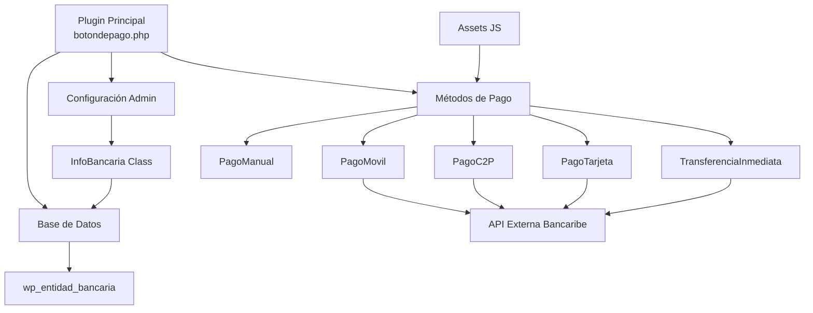
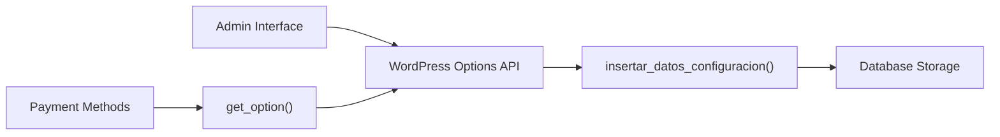
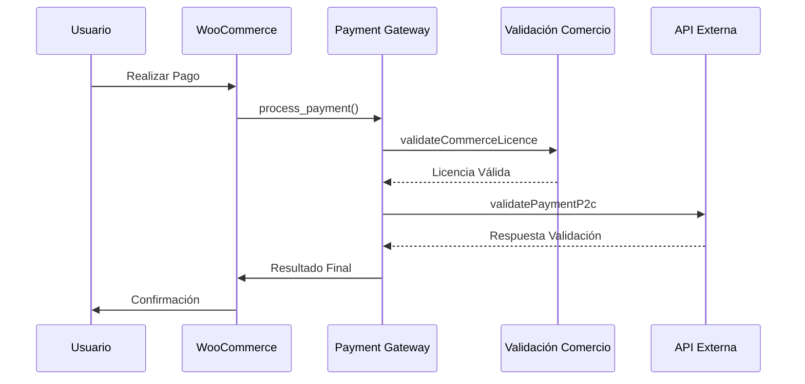
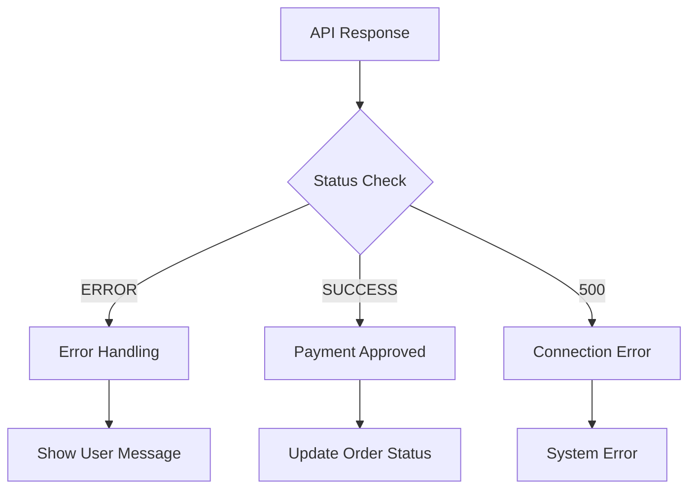
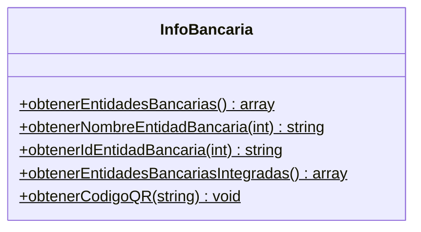
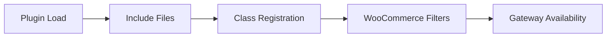

# Documentación Técnica: Payment Gateway Methods

**Versión:** 1.7.9  
**Fecha:** Diciembre 2024  
**Autor:** Technology Consulting Solutions (T.C.S)  

## Resumen

El módulo **Payment Gateway Methods** es un plugin para WooCommerce que implementa múltiples métodos de pago venezolanos integrados con APIs bancarias externas. [1](#0-0)  El sistema proporciona cinco métodos de pago especializados: Pago Móvil P2C, Pago C2P, Pago Manual, Pago con Tarjeta y Transferencia Inmediata, todos con validación en tiempo real a través de servicios externos.

## Diagrama de Arquitectura General



## Estructura Común de Clases

Todos los métodos de pago siguen una arquitectura común basada en herencia de `WC_Payment_Gateway`:


### Propiedades Comunes

Cada método de pago implementa las siguientes propiedades base: [2](#0-1) 

- **ID único:** Identificador del gateway de pago
- **Título del método:** Nombre mostrado al usuario
- **Descripción:** Información detallada del método
- **Soporte de productos:** Compatibilidad con productos WooCommerce
- **Campos personalizados:** Formularios específicos por método

## Métodos de Pago Implementados

### 1. PagoMovil (Pago Móvil P2C)

**Archivo:** `metodosPago/pagoMovil.php`

**Características:**
- **ID:** `pago_movil` [3](#0-2) 
- **Integración:** API Bancaribe para validación inmediata
- **Campos de entrada:** Documento, banco, teléfono, monto, referencia
- **Código QR:** Generación automática para facilitar pagos [4](#0-3) 

**Validaciones específicas:**
- Documento mínimo 6 dígitos [5](#0-4) 
- Teléfono mínimo 7 dígitos [6](#0-5) 
- Referencia mínimo 6 dígitos [7](#0-6) 

### 2. PagoC2P (Commerce to Person)

**Archivo:** `metodosPago/pagoC2P.php`

**Características:**
- **ID:** `pago_c2p` [8](#0-7) 
- **Especialización:** Pagos de comercio a persona
- **Integración:** Solo entidades bancarias integradas [9](#0-8) 

### 3. PagoManual (Reporte Manual)

**Archivo:** `metodosPago/pagoManual.php`

**Características:**
- **ID:** `pago_manual` [10](#0-9) 
- **Modalidad:** Verificación manual posterior
- **Datos mostrados:** Información bancaria completa para transferencia [11](#0-10) 

### 4. PagoTarjeta (Pago con Tarjeta)

**Archivo:** `metodosPago/pagoTarjeta.php`

**Características:**
- **ID:** `pago_tarjeta` [12](#0-11) 
- **Procesamiento:** Pagos con tarjetas de crédito/débito
- **Assets específicos:** Logo de tarjetas [13](#0-12) 

### 5. TransferenciaInmediata

**Archivo:** `metodosPago/transferenciaInmediata.php`

**Características:**
- **ID:** `trf_inmediata` [14](#0-13) 
- **Funcionalidad:** Transferencias bancarias en tiempo real
- **Información:** Datos completos del comercio [15](#0-14) 

## Sistema de Configuración Admin

### Interfaz de Administración

El sistema incluye un menú administrativo completo: [16](#0-15) 

**Campos de configuración principales:**
- Nombre del comercio [17](#0-16) 
- Tipo de documento [18](#0-17) 
- RIF/Cédula [19](#0-18) 
- Código de activación [20](#0-19) 
- Información bancaria [21](#0-20) 
- Credenciales API Bancaribe [22](#0-21) 

### Gestión de Configuración



Las configuraciones se almacenan usando WordPress Options API: [23](#0-22) 

## Flujo de Integración con API Externa

### Proceso de Validación de Pagos



### APIs y Endpoints

**Endpoint de validación de comercio:** [24](#0-23) 
- URL: `http://localhost:4000/api/validateCommerceLicence`
- Método: POST
- Headers: Content-Type, User-Agent, KEY

**Endpoint de validación de pagos P2C:** [25](#0-24) 
- URL: `http://172.30.145.250:4000/api/validatePaymentP2c`  
- Método: POST
- Parámetros: RIF, documento pagador, teléfono, referencia, monto, banco

**Endpoint de código QR:** [26](#0-25) 
- URL: `http://172.30.145.250:4000/api/downloadQrByCommerce`
- Funcionalidad: Generación de códigos QR para pagos móviles

## Integración Externa y Seguridad

### Autenticación y Seguridad

**Headers de seguridad:**
- Content-Type: application/json
- User-Agent: Mozilla/5.0  
- KEY: key12345 [27](#0-26) 

**Validación de respuestas:**
- Detección de encoding automática [28](#0-27) 
- Manejo de errores específicos [29](#0-28) 

### Manejo de Errores



## Sistema de Gestión de Base de Datos

### Estructura de Tablas

**Tabla: `wp_entidad_bancaria`** [30](#0-29) 

```sql
CREATE TABLE wp_entidad_bancaria(
    id INT NOT NULL AUTO_INCREMENT,
    nombre VARCHAR(45) NOT NULL,
    codigo_bin VARCHAR(4) NOT NULL,
    isIntegrado BOOLEAN NOT NULL,
    status BOOLEAN DEFAULT false,
    PRIMARY KEY (id)
);
```

### Clase InfoBancaria

**Funcionalidades principales:** [31](#0-30) 



### Datos Iniciales

El sistema incluye 25 entidades bancarias venezolanas precargadas: [32](#0-31) 

## Estructura del Proyecto

```
plugin_boton_pago/
├── botondepago.php          # Archivo principal del plugin
├── metodosPago/             # Directorio de métodos de pago
│   ├── pagoMovil.php       # Pago Móvil P2C
│   ├── pagoC2P.php         # Commerce to Person
│   ├── pagoManual.php      # Reportes manuales
│   ├── pagoTarjeta.php     # Pagos con tarjeta
│   └── transferenciaInmediata.php  # Transferencias
└── assets/                  # Recursos estáticos
    └── js/                  # Scripts JavaScript
        ├── pagoMovilScript.js
        ├── pagoC2PScript.js
        ├── pagoManualScript.js
        ├── pagoTarjetaJS.js
        └── transferenciaInmediataScript.js
```

### Registro de Métodos de Pago

Los métodos se registran en WooCommerce mediante filtros: [33](#0-32) 



## Análisis de Secciones Padre

### Hooks y Activación

**Activación del plugin:** [34](#0-33) 
- Creación de tablas de base de datos
- Inserción de registros iniciales de bancos

**Hooks de WordPress:** [35](#0-34) 
- `register_activation_hook`: Configuración inicial
- `register_deactivation_hook`: Limpieza

### Compatibilidad

**Verificación de WooCommerce:** [36](#0-35) 
- Control de versión automático
- Validación de dependencias

**Carga condicional de métodos:** [37](#0-36) 

## Notas

**Aspectos importantes identificados:**

1. **Arquitectura modular:** Cada método de pago es un archivo independiente que extiende la funcionalidad base de WooCommerce.

2. **Integración API centralizada:** Todos los métodos utilizan endpoints similares con diferentes parámetros según el tipo de pago.

3. **Configuración unificada:** Un solo panel de administración gestiona las credenciales para todos los métodos.

4. **Base de datos optimizada:** Tabla específica para entidades bancarias venezolanas con códigos BIN oficiales.

5. **Seguridad implementada:** Validación de licencias comerciales antes del procesamiento de pagos.

6. **Manejo de errores robusto:** Diferentes tipos de respuesta según el estado de la transacción y errores específicos del banco.

La documentación refleja un sistema maduro y bien estructurado para el procesamiento de pagos electrónicos venezolanos con integración directa a sistemas bancarios.
